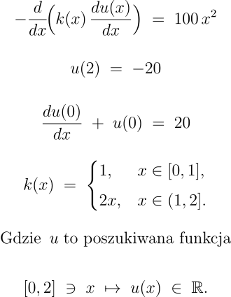

# Rozwiązanie równania transportu ciepła metodą elementów skończonych (FEM)

**Projekt został zrealizowany w ramach przedmiotu "Równania różniczkowe i różnicowe", prowadzonego na II roku studiów na kierunku Informatyka na Wydziale Informatyki Akademii Górniczo-Hutniczej.**

W repozytorium znajdują się:

1. **`sformulowanie_slabe.pdf`**  
   Plik PDF z **wyprowadzeniem sformułowania wariacyjnego (słabego)** dla przedstawionego równania różniczkowego z odpowiednimi warunkami brzegowymi.  

2. **`FEM.py`**  
   **Kod programu** napisanego w Pythonie, który rozwiązuje zadany problem metodą elementów skończonych FEM.  

3. **`equation.png`**  
   Obrazek przedstawiający zapisane matematycznie równanie różniczkowe oraz warunki brzegowe rozwiązywanego problemu.

4. **`README.md`**  
   Plik z opisem (który właśnie czytasz).

---

## Opis problemu

Rozważamy zagadnienie transportu ciepła w przedziale [0, 2]. Równanie różniczkowe ma postać:

---
## Plik PDF – sformułowanie słabe

W pliku **sformulowanie_slabe.pdf** zawarto:

1. Szczegółowe **wyprowadzenie sformułowania wariacyjnego** (słabego) dla powyższego problemu.
2. Opis metodologii przejścia od postaci różniczkowej do postaci całkowej, z uwzględnieniem warunków brzegowych typu Robina (w x=0) i Dirichleta (w x=2).

## Kod źródłowy – FEM.py

Kod w pliku **FEM.py**:
- Generuje **siatkę** (punkty węzłowe) na odcinku [0, 2].
- Buduje **macierz sztywności** (stiffness matrix) oraz **wektor obciążenia** (load vector) w oparciu o funkcje kształtu elementów skończonych, uwzględniając warunki brzegowe.
- Rozwiązuje układ równań metodą **numpy.linalg.solve**.
- Zwraca (i/lub wizualizuje) dyskretne przybliżenie rozwiązania u(x) w węzłach.

### Główne funkcje w FEM.py związane z rozwiązywaniem równania transportu ciepła: 

1. **generate_points(start, end, number_of_elements)**  
   Tworzy równomiernie rozłożone punkty (węzły) na zadanym przedziale.  

2. **generate_B_matrix(node_positions)**  
   Tworzy globalną macierz sztywności B, uwzględniając współczynnik przewodzenia k(x) i warunki brzegowe.  

3. **generate_L_matrix(node_positions)**  
   Tworzy globalny wektor obciążeń L, zawierający wkład od funkcji f(x) = 100*x^2 i uwzględniający warunek brzegowy Robina na lewym końcu (x=0) i Dirichleta na prawym (x=2).  

4. **solve_heat_equation(start, end, number_of_elements)**  
   Główna funkcja, która:  
   - Generuje siatkę,  
   - Buduje macierz B i wektor L,  
   - Rozwiązuje liniowy układ równań,  
   - Zwraca wektor węzłów i przybliżone rozwiązanie \(\displaystyle u\).
   - Wizualizuje rozwiązanie.

---
## Autor:
**Maciej Kmąk**
